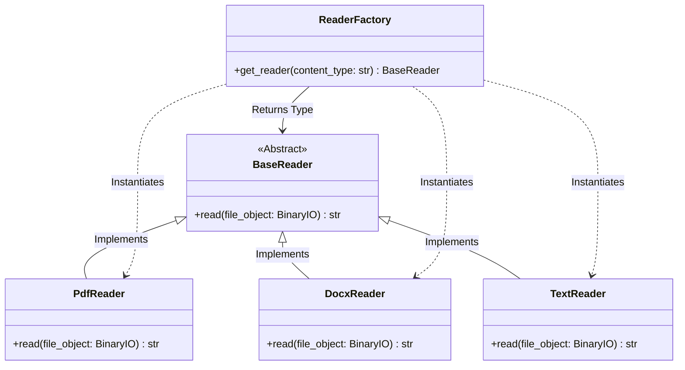

## Class Diagram

```mermaid
classDiagram
    class BaseReader {
        <<Abstract>>
        +read(file_object: BinaryIO) str
    }
    class PdfReader {
        +read(file_object: BinaryIO) str
    }
    class DocxReader {
        +read(file_object: BinaryIO) str
    }
    class TextReader {
        +read(file_object: BinaryIO) str
    }
    class ReaderFactory {
        +get_reader(content_type: str) BaseReader
    }

%% Inheritance
    BaseReader <|-- PdfReader : Implements
    BaseReader <|-- DocxReader : Implements
    BaseReader <|-- TextReader : Implements

%% Factory relationships
    ReaderFactory ..> PdfReader : Instantiates
    ReaderFactory ..> DocxReader : Instantiates
    ReaderFactory ..> TextReader : Instantiates

%% Return relationship
    ReaderFactory --> BaseReader : Returns Type
```