# Sequence Diagram: Reader Strategy Execution Flow

This UML Sequence Diagram illustrates the dynamic behavior of the system during file processing.
It highlights the interaction between the Controller, the Factory and the concrete Reader implementation, 
specifically focusing on the lifecycle and error handling mechanisms.

```mermaid
sequenceDiagram
    autonumber
    %% Define static participants
    participant Client as FileController
    participant Factory as ReaderFactory
    %% Note: The Reader is not defined here yet, as it is created dynamically.
    participant Lib as External Library (pypdf/docx)

    %% --- Instantiation ---
    Note over Client, Factory: 1. Strategy Selection
    
    Client->>Factory: get_reader(mime_type)
    activate Factory
    
    %% The Factory decides and Creates the object now
    create participant Reader as :BaseReader
    Factory->>Reader: <<create>> (Instantiate)
    activate Reader
    Reader-->>Factory: instance created
    deactivate Reader

    Factory-->>Client: return Reader instance
    deactivate Factory

    %% --- Execution ---
    Note over Client, Reader: 2. Polymorphic Execution & Error Handling

    Client->>Reader: read(file_stream)
    activate Reader
    
    %% Try-Catch Block visualization
    %% Changed color to black 
    rect rgb(45, 0, 0)
        note right of Reader: Try-Catch Scope
        Reader->>Lib: parse(stream)
        activate Lib
        
        alt Parsing Success
            Lib-->>Reader: raw content / pages
            Reader->>Reader: clean and join text
        else Library Failure
            Lib-->>Reader: raise LibraryError
            Reader->>Reader: catch exception
            Reader->>Reader: raise new Exception
        end
        deactivate Lib
    end

    %% Return result to Controller
    Reader-->>Client: return Result (Text or Error)
    deactivate Reader

    %% --- Cleanup ---
    Note over Client, Reader: 3. Lifecycle End (Garbage Collection)
    destroy Reader
    Client-xReader: (Object goes out of scope)
```

